# Banking Platform — Service Dependency Diagram

> Visual map of all services and their **inter-service** dependencies.
> Arrow direction: consumer → provider (data flow direction).

```mermaid
---
config:
  theme: base
  themeVariables:
    lineColor: "#888"
    fontSize: 13px
  flowchart:
    nodeSpacing: 80
    rankSpacing: 120
    padding: 16
    subGraphTitleMargin:
      top: 8
      bottom: 4
    defaultRenderer: elk
---
graph LR

%% ============================================================
%% STYLES
%% ============================================================
classDef ext fill:#f9f0ff,stroke:#9b59b6,color:#333
classDef ibank fill:#e3f2fd,stroke:#2196f3,color:#333
classDef cbs fill:#fce4ec,stroke:#e91e63,color:#333
classDef temenos fill:#e0f7fa,stroke:#00897b,color:#333
classDef pay fill:#f3e5f5,stroke:#8e24aa,color:#333
classDef aml fill:#fff8e1,stroke:#f9a825,color:#333
classDef fx fill:#e8eaf6,stroke:#3f51b5,color:#333
classDef crypto fill:#efebe9,stroke:#795548,color:#333
classDef baas fill:#e0f2f1,stroke:#00796b,color:#333
classDef platform fill:#f1f8e9,stroke:#558b2f,color:#333

%% ============================================================
%% EXTERNAL SYSTEMS
%% ============================================================
subgraph EXT["External Systems"]
    T24["Temenos T24"]
    SV["SmartVista"]
    SF["Salesforce"]
    SS["SumSub"]
    OBC["ObConnect"]
    SWIFT_NET["SWIFT"]
    SEPA_CSM["SEPA CSM"]
    TIPS["RT1/TIPS"]
    TARGET2["TARGET2"]
    FPS_NET["UK FPS"]
    SUCDEN["Sucden"]
    FCM["Firebase"]
    FUTURAE["Futurae"]
    CRYPTOLOGY["Cryptology"]
    COINGECKO["CoinGecko"]
    INFURA["Infura/Ethereum"]
    FORMANCE["Formance Ledger"]
    ZEEBE["Zeebe/Camunda"]
    SORTWARE["IBAN.com/SortWare"]
    HSM["CloudHSM"]
end
class T24,SV,SF,SS,OBC,SWIFT_NET,SEPA_CSM,TIPS,TARGET2,FPS_NET,SUCDEN,FCM,FUTURAE,CRYPTOLOGY,COINGECKO,INFURA,FORMANCE,ZEEBE,SORTWARE,HSM ext

%% ============================================================
%% iBANK FRONTEND
%% ============================================================
subgraph IBANK_FE["iBank Frontend"]
    UUI["unlimint-ui"]
    UIAUTH["ibank-ui-auth-api"]
    UNAC["unac-frontend-shared"]
    BREXT["browser-extension-gateway"]
end
class UUI,UIAUTH,UNAC,BREXT ibank

UUI -.-> UIAUTH
UUI -.-> UNAC

%% ============================================================
%% iBANK BACKEND
%% ============================================================
subgraph IBANK_BE["iBank Backend"]
    IB["ibank-backend"]
    IAUTH["ibank-auth-api"]
    INOT["ibank-notification"]
    IONB["ibank-onboarding-api"]
    IOPEN["ibank-open-api"]
    MOBGW["mobile-gateway-api"]
    BFFAUTH["bff-auth-api"]
    CHAT["chat-api"]
end
class IB,IAUTH,INOT,IONB,IOPEN,MOBGW,BFFAUTH,CHAT ibank

UUI ==> IB
UUI ==> IAUTH
MOBGW ==> IB
MOBGW ==> CAPI
MOBGW ==> CBUY
MOBGW ==> UM
MOBGW ==> DICT
BREXT ==> IB
IOPEN ==> IB
IOPEN ==> APIGW
IAUTH --> FUTURAE
IAUTH ==> FUTP
IB ==> INOT
IB -.->|RabbitMQ| EXEC
INOT --> FCM
INOT -.->|RabbitMQ| IB

%% ============================================================
%% PLATFORM SERVICES
%% ============================================================
subgraph PLATFORM["Platform Services"]
    DICT["dictionaries-api"]
    TXN["transactions-api"]
    RPT["reports-api"]
    LIM["limits-api"]
    UM["user-management-api"]
    CARDS["cards-api"]
    COP["payee-confirmation-api"]
    SSCHED["stable-scheduler"]
    ISOLR["ibank-solr"]
end
class DICT,TXN,RPT,LIM,UM,CARDS,COP,SSCHED,ISOLR platform

IB ==> DICT
IB ==> TXN
IB ==> RPT
IB ==> LIM
IB ==> UM
IB ==> COP
IB ==> CARDS
IONB --> SS

TXN ==> UM
TXN ==> TGW
TXN ==> DICT
TXN -.->|RabbitMQ| NOTIF
RPT ==> TGW
LIM ==> TXN
LIM ==> UM
UM ==> TGW
UM ==> IAUTH
UM ==> BGWAPI
UM ==> RPT
UM ==> INOT
UM ==> DICT
UM --> FUTURAE
UM -.->|SNS/SQS| TEVT
COP ==> BGWAPI
COP --> OBC
DICT --> SORTWARE
DICT ==> IPS
DICT ==> CBSM

%% ============================================================
%% CBS CORE
%% ============================================================
subgraph CBS["CBS Core"]
    CBSM["cbs"]
    EXEC["cbs-executor"]
    APIGW["cbs-api-gateway"]
    PERM["cbs-permissions"]
    RATE["cbs-rate-plans"]
    SCHED["cbs-scheduler"]
    CBSRPT["cbs-reports"]
    OPLOGS["cbs-operation-logs"]
    EXCHRT["cbs-exchange-router"]
    CBSUI["cbs-ui"]
    ETOOL["executor-toolset"]
end
class CBSM,EXEC,APIGW,PERM,RATE,SCHED,CBSRPT,OPLOGS,EXCHRT,CBSUI,ETOOL cbs

CBSUI ==> APIGW
APIGW ==> EXEC
APIGW -.->|RabbitMQ| EXEC
CBSM -.->|RabbitMQ| EXEC
SCHED ==> EXEC
CBSRPT -.->|RabbitMQ| EXEC
OPLOGS -.->|RabbitMQ| CBSM

IB ==> EXEC
IB ==> APIGW

%% ============================================================
%% CBS SMARTVISTA
%% ============================================================
subgraph CBS_SV["CBS SmartVista"]
    SVAPIG["cbs-sv-apigate"]
    SVINT["cbs-sv-integrator"]
end
class SVAPIG,SVINT cbs

SVAPIG -.->|RabbitMQ| EXEC
SVINT -.->|RabbitMQ| EXEC
SVINT --> SV
SVAPIG --> SV

%% ============================================================
%% TEMENOS INTEGRATION
%% ============================================================
subgraph TEMENOS["Temenos Integration"]
    TGW["temenos-gateway-api"]
    TEVT["temenos-events-service"]
    NOTIF["cbs-ibank-notifier"]
end
class TGW,TEVT,NOTIF temenos

IB ==> TGW
TGW --> T24
TGW ==> DICT
TEVT -.->|SNS/SQS| TXN
TEVT -.->|SNS/SQS| AMLS
TEVT -.->|SNS/SQS| AMLP
TEVT -.->|SNS/SQS| FXR
TEVT -.->|SNS/SQS| SIRT
NOTIF -.->|RabbitMQ| TXN

%% ============================================================
%% PAYMENT CONNECTORS
%% ============================================================
subgraph PAY_CONN["Payment Connectors"]
    TSEPA["temenos-sepa-connector"]
    TSWIFT["temenos-swift-connector"]
    TSI["temenos-si-connector"]
    TTARGET["temenos-target-connector"]
    TFPS["temenos-fps-connector"]
end
class TSEPA,TSWIFT,TSI,TTARGET,TFPS pay

TSEPA --> T24
TSEPA --> SEPA_CSM
TSWIFT --> T24
TSWIFT --> SWIFT_NET
TSI --> T24
TTARGET --> T24
TTARGET --> TARGET2
TFPS --> T24
TFPS --> FPS_NET

%% ============================================================
%% PAYMENT INFRASTRUCTURE
%% ============================================================
subgraph PAY_INFRA["Payment Infrastructure"]
    IPS["cbs-ips"]
    SI["sepa-instant"]
    SIRT["sepa-instant-cbs-temenos-router"]
end
class IPS,SI,SIRT pay

IB ==> IPS
IPS ==> CBSM
IPS -.->|RabbitMQ| EXEC
SI --> HSM
SI --> TIPS
SIRT ==> SI
SIRT ==> TSI

%% ============================================================
%% AML / COMPLIANCE
%% ============================================================
subgraph AML["AML / Compliance"]
    AMLS["aml-screening"]
    AMLI["aml-blacklist-index"]
    AMLP["aml-payment"]
    AMLUI["aml-ui"]
    DEAML["cbs-de-aml"]
end
class AMLS,AMLI,AMLP,AMLUI,DEAML aml

AMLS ==> AMLI
AMLP ==> AMLS
AMLUI ==> AMLS
AMLUI ==> AMLP

%% ============================================================
%% FX / TREASURY
%% ============================================================
subgraph FX["FX / Treasury"]
    FXR["fx-router"]
    FXSC["fx-sucden-connector"]
    AFXUI["auto-fx-ui"]
end
class FXR,FXSC,AFXUI fx

FXR ==> FXSC
FXR -.->|RabbitMQ| EXEC
FXSC --> SUCDEN
AFXUI ==> FXR

%% ============================================================
%% CRYPTO
%% ============================================================
subgraph CRYPTO["Crypto"]
    CAPI["crypto-api"]
    CACC["crypto-accounting"]
    CBUY["crypto-buysell-api"]
    BSBO["buysell-backoffice"]
end
class CAPI,CACC,CBUY,BSBO crypto

IB ==> CAPI
IB ==> CACC
IB ==> CBUY
CAPI ==> INOT
CAPI ==> BSBO
CAPI -.->|RabbitMQ| EXEC
CAPI --> CRYPTOLOGY
CAPI --> COINGECKO
CAPI --> INFURA
CACC --> FORMANCE
CBUY --> ZEEBE
CBUY ==> CAPI
CBUY ==> CACC
BSBO ==> CBUY

%% ============================================================
%% BaaS PLATFORM
%% ============================================================
subgraph BAAS["BaaS Platform"]
    BAGW["api-gateway"]
    BCOMM["commons"]
    BOOB["smartvista-oob-service"]
    BWH["webhook-service"]
    BCICD["baas-cicd"]
end
class BAGW,BCOMM,BOOB,BWH,BCICD baas

IB ==> BAGW
BAGW --> SV
BAGW --> T24
BAGW --> SF
BAGW --> SS
BAGW ==> BOOB
BAGW -.->|SNS/SQS| BWH
BOOB --> SV
COP ==> BAGW

%% ============================================================
%% INTEGRATION BRIDGES
%% ============================================================
subgraph BRIDGE["Integration Bridges"]
    BINT["baas-integration-api"]
    BGWAPI["baas-gateway-api"]
end
class BINT,BGWAPI baas

BINT ==> BAGW
BINT ==> UM
BINT ==> LIM
BINT ==> COP
BINT -.->|RabbitMQ| EXEC
BGWAPI ==> BAGW
IB ==> BGWAPI

%% ============================================================
%% SECURITY / MFA
%% ============================================================
subgraph MFA_GRP["Security / MFA"]
    FUTP["futurae-proxy"]
end
class FUTP ibank

FUTP --> FUTURAE
FUTP -.->|RabbitMQ| IB

%% ============================================================
%% B2B CARDS PLATFORM
%% ============================================================
classDef b2b fill:#fff3e0,stroke:#e65100,color:#333

subgraph B2B_BE["B2B Cards Backend"]
    B2BAPP["app (Partner API)"]
    B2BISS["issuing-api"]
    B2BDASH["dashboard-api"]
    B2BWH["webhooks-api"]
    B2BCW["cards-worker"]
    B2BCBSW["cbs-worker"]
    B2BIFAPI["iframes-api"]
    B2BIF["iframes"]
    B2BSVSOCK["sv-socket"]
    B2BACS["transaction-acs-api"]
    B2BRMQ["rabbitmq-bridge-listener"]
end
class B2BAPP,B2BISS,B2BDASH,B2BWH,B2BCW,B2BCBSW,B2BIFAPI,B2BIF,B2BSVSOCK,B2BACS,B2BRMQ b2b

subgraph B2B_FE["B2B Cards Frontend"]
    B2BDASHUI["dashboard (Vue)"]
    B2BFRONT["front (Nuxt)"]
end
class B2BDASHUI,B2BFRONT b2b

%% B2B Frontend → Backend
B2BDASHUI ==> B2BDASH
B2BFRONT ==> B2BIFAPI

%% B2B internal service dependencies
B2BAPP ==> B2BISS
B2BAPP --> SF
B2BAPP --> SS
B2BDASH ==> B2BAPP
B2BIFAPI ==> B2BAPP
B2BIFAPI ==> B2BISS
B2BIFAPI --> SF
B2BCW ==> B2BISS
B2BCW -.->|RabbitMQ| B2BAPP
B2BCBSW -.->|RabbitMQ| B2BAPP
B2BRMQ -.->|RabbitMQ| B2BAPP
B2BRMQ -.->|RabbitMQ| B2BCBSW

%% B2B → External Systems
B2BISS --> SV
B2BSVSOCK --> SV
B2BACS --> SS

%% B2B → BaaS Platform (bridge)
B2BAPP ==> BAGW
```

## Legend

| Line Style | Meaning |
|------------|---------|
| `A ==> B` | Synchronous REST / gRPC / Feign call |
| `A --> B` | Connection to external system |
| `A -.->│broker│ B` | Async messaging between services (label = broker type) |

## What is NOT shown

- **Keycloak** — universal dependency; every service uses it for OAuth2/JWT
- **Data stores** (PostgreSQL, Oracle, Redis, Solr, MongoDB, DynamoDB) — private to each service; documented in `.ai/service-description.md`
- **Message brokers as standalone nodes** — shown only as edge labels when they mediate inter-service communication
